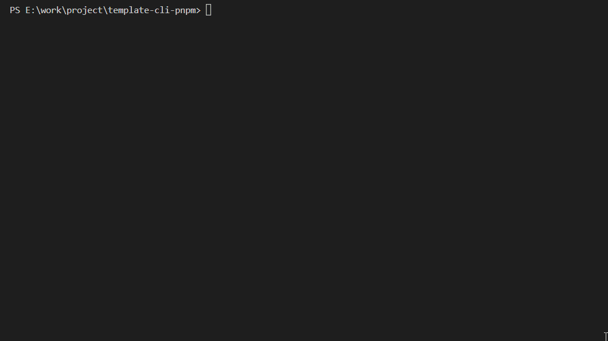
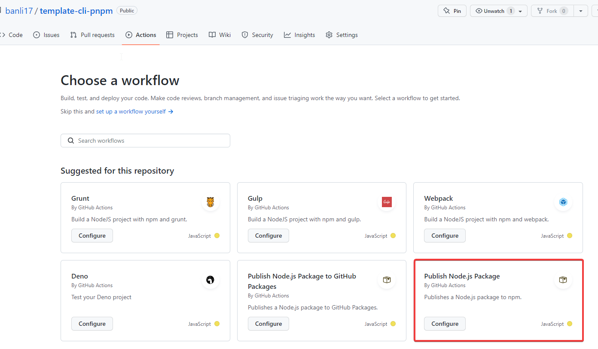
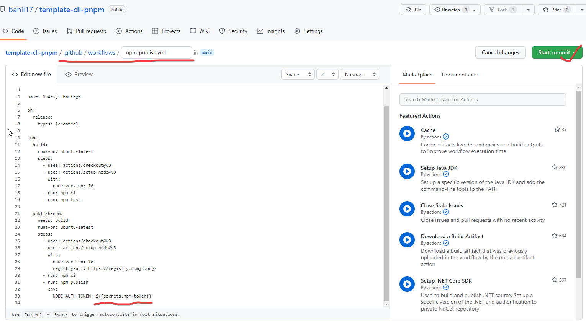
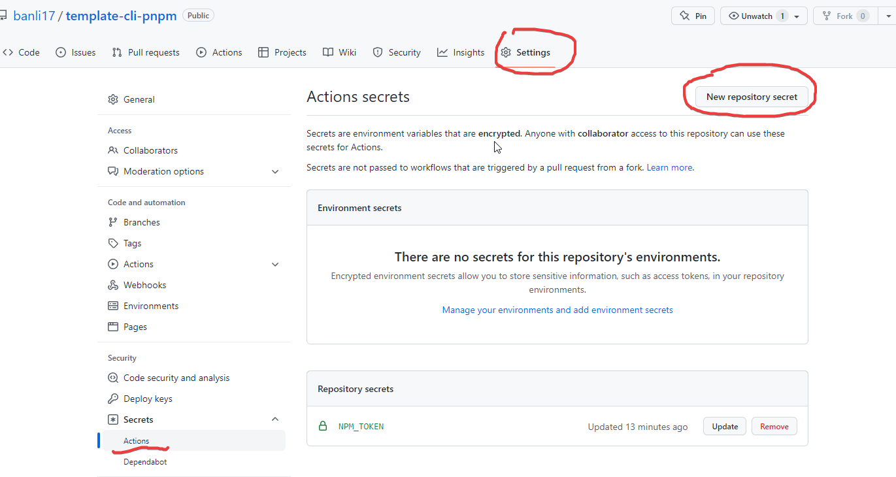
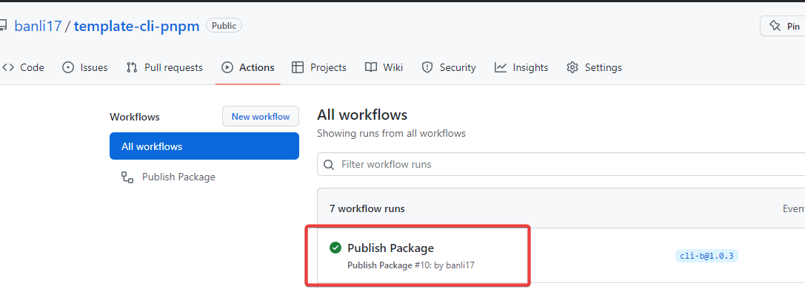
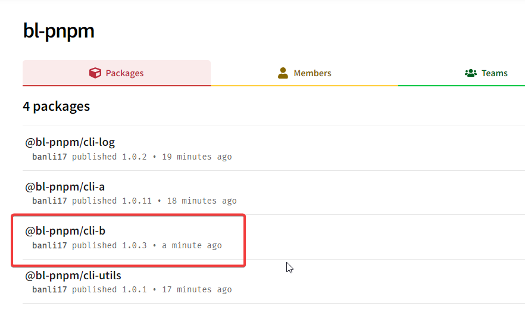

# monorepo

## pnpm + workspace

为什么用它？

- npm、yarn 幽灵依赖
- pnpm 高性能
- workspace: npm 8 支持 workspace, pnpm 和 yarn 默认支持 workspace
- lerna 停止维护

## npm run pub 做了什么

1、选择要发布到包。
2、选择包的版本。
3、提示是否确认发布？
4、

## 使用 github action 的 CI/CD

npm pub 完成后，会打 tag 并将代码提交到 github，后续将包发布到 npm 的工作可以使用 github action 来实现。

1、新增一个发布包工作流。它会在 .github/workflows 目录下新建一个文件。新建后，在本地 git pull 下，就可以在本地看到该文件了。

2、发布 npm 需要 npm 秘钥。也就是 `${{secrets.npm_token}}`。这里需要去 npm 官网创建一个。

3、创建好后，将 token 粘贴到 github 仓库 setting -> action 的秘钥里。

4、当有内容 push 到 github 仓库时，github 就会执行 action。

5、可以看到上面已经成功发布 @bl-pnpm/cli-b 包到 npm 仓库了。

## vscode spell 关闭

开启 spell 时，很多单词会提示拼写错误，所以将 spell 功能关闭。

